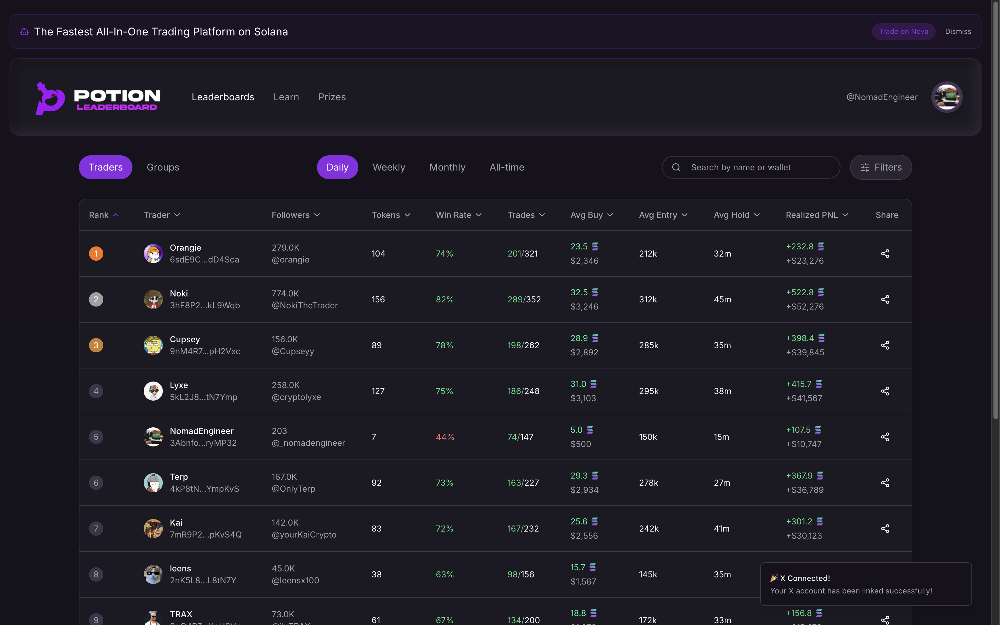

# <a href="https://docs.potionvision.com/frontend-developer-challenge-2025-02">  </a> Potion Alpha Frontend Developer Challenge



### **Overview & Background**

**About Potion Leaderboard:**

Potion Leaderboard is a gamified platform where every Solana memecoin trader—from beginner to expert—competes, showcases their performance, and wins rewards. The platform’s first MVP includes a public Leaderboards page (with Daily, Weekly, Monthly, and All-Time views) that lists traders’ wallets, performance metrics, profile details, and social connections.

**Challenge Goal:**

Create a responsive, visually compelling Leaderboard page that fetches and displays trader data from a mock API. This page should mimic the look and feel outlined in the [Figma](https://www.figma.com/proto/4UbpftRYpuL5SczCjk9eOW/Potion-Leaderboard?node-id=21-5&p=f&t=ApOpU9XiygjA2oYR-0&scaling=min-zoom&content-scaling=fixed&page-id=0%3A1) design provided and incorporate core UI interactions such as search and filtering.


## 📖 Table of Contents
- [About The Project](#about-the-project)
  - [Key Features](#key-features)
  - [Built With](#built-with)
- [Getting Started](#getting-started)
  - [Prerequisites](#prerequisites)
  - [Installation](#installation)
- [Project Structure](#project-structure)
  - [Core Components](#core-components)
  - [Pages](#pages)
  - [Utilities](#utilities)
- [Features & Usage](#features--usage)
  - [Wallet Connection](#wallet-connection)
  - [Leaderboard Navigation](#leaderboard-navigation)
  - [Trader Profiles](#trader-profiles)
  - [Trade Analytics](#trade-analytics)
- [Testing Guide](#testing-guide)
- [UI Components](#ui-components)


> 💡 **Screenshot Suggestion**: Add a screenshot of the main leaderboard page here showing the key UI elements like the leaderboard table, filters, and time frame selector.

## 🚀 My Journey

As a developer working on the Potion Leaderboard project, I embraced modern development practices by leveraging the Lovable AI platform to streamline my workflow. With my foundation in web development, I was able to focus on the core features while Lovable assisted with implementation details and best practices. This approach allowed me to efficiently create a responsive, feature-rich leaderboard that showcases Solana memecoin trader performances and to achieve the challenge to the best of my ability.

Throughout the development process, I prioritized creating an intuitive user interface, implementing comprehensive filtering capabilities, and ensuring mobile responsiveness. The combination of my vision and Lovable's assistance resulted in a polished platform that meets the Potion Alpha Leaderboard requirements. 

### Key Features

- 📊 Mock API data performance tracking
- 🏆 Daily, weekly, and monthly competitions
- 👥 Detailed trader profiles
- 📱 Fully responsive design
- 🔍 Advanced filtering & search
- 🔗 Social media mock integration
- 💰 Comprehensive trade analytics

### Built With

- React + TypeScript
- Vite
- Tailwind CSS
- shadcn/ui
- Lucide React Icons

## 🚀 Getting Started

### Prerequisites

- Node.js (v18+)
- npm or yarn
- Git

### Installation

```bash
# Clone the repository
git clone https://github.com/747-diego/Potion-Alpha-Frontend-Developer-Challenge.git

# Install dependencies
npm install

# Start development server
npm run dev
```

## 📁 Project Structure

### Core Components

#### `src/components/`

> 💡 **Screenshot Suggestion**: Add component screenshots in their respective sections to show their appearance and functionality

##### Header (`Header.tsx`)
- Main navigation component
- Handles wallet connection
- Manages X/Twitter integration
- Responsive mobile menu

```typescript
// Key features:
- Wallet connection status management
- Social media integration
- Responsive navigation
- Profile picture display
```

##### FilterBar (`FilterBar.tsx`)
- Time frame selection (Daily/Weekly/Monthly/All-time)
- View mode switching (Traders/Groups)
- Search functionality
- Advanced filtering system

```typescript
// Notable functionality:
- Advanced search capabilities
- Time frame management
- Responsive design adaptations
```

##### LeaderboardTable (`LeaderboardTable.tsx`)
- Displays trader rankings
- Sortable columns
- Performance metrics
- Mobile-responsive layout
- Share functionality (mobile/web)

##### Profile Components
- `ProfileHeader.tsx`: Trader identity and social links
- `ProfileStats.tsx`: Performance metrics display
- `TradesSection.tsx`: Detailed trade history
- `TimeFrameSelector.tsx`: Time period filtering

### Pages

#### `src/pages/`

##### Index Page (`Index.tsx`)
- Main leaderboard view
- Handles trader filtering
- Manages view modes

##### Profile Page (`Profile.tsx`)
- Individual trader profiles
- Trade history
- Performance metrics
- Social integration

### Utilities

#### `src/utils/`
- `format.ts`: Number and address formatting
- `tradeUtils.ts`: Trade calculations and sorting

## 🎮 Features & Usage

### Wallet Connection

To access protected features:

1. Click "Connect Wallet" in the header or pop-up
2. It will be linked to my mock wallet address
3. (Optional) Connect X/Twitter account
4. If connected it will also be signed in as me, the: NomadEngineer

> 💡 **Screenshot Suggestion**: Add a screenshot of the wallet connection flow

### Leaderboard Navigation

Time Frame Selection:
- Daily (24h performance)
- Weekly (7-day metrics)
- Monthly (30-day stats)
- All-time (Complete history)

Filtering:
1. Click the "Filters" button
2. Adjust parameters:
   - Min/Max followers
   - Win rate threshold
   - Minimum trades
   - PNL requirements

Search:
- Use the search bar for wallet addresses or usernames
- Results update in real-time

### Trader Profiles

Access detailed trader information:

1. Click on any trader row in the leaderboard
2. View comprehensive stats:
   - Win rate
   - Total trades
   - Average position size
   - PNL metrics
3. Explore trade history
4. Share a trade via X using the share icon

> 💡 **Screenshot Suggestion**: Add a screenshot of a trader profile page

### Trade Analytics

Each profile includes:

- ROI calculations
- Win/loss ratios
- Average hold times
- Position sizing metrics
- Trade frequency analysis

## 🧪 Testing Guide

### 1. Wallet Integration
```bash
# Test wallet connection:
1. Click "Connect Wallet" via header or pop-up
2. Check profile picture update to default pixel avatar
```

### 2. Leaderboard Functionality
```bash
# Test sorting:
1. Click column headers
2. Verify sort direction
3. Check data accuracy

# Test filtering:
1. Open filter drawer
2. Apply various combinations
3. Verify results
4. Test clear-filters for reset functionality
```

### 3. Profile Navigation
```bash
# Test profile access:
1. Click a trader profile picture in the leaderboard
2. If connected it will bring you their profile
3. Check social links (x.com)
4. Test if X account is accurate
```

### 4. Mobile Responsiveness
```bash
# Test on multiple devices / personal device:
1. Check table scrolling
2. Verify menu functionality
3. Test filter drawer
4. Verify profile layout
```

## 🎨 UI Components

### Glass Card Design
```typescript
// Styling class for glass effect
className="glass-card rounded-lg border border-white/10 
          hover:border-primary/20 transition-colors"
```

### Responsive Table
```typescript
// Mobile optimization
const isMobile = useIsMobile();
// Conditional rendering based on screen size
```

### Animations
- Fade-in effects
- Hover transitions
- Loading states
- Smooth scrolling


---

> 💡 **Note**: For all screenshots, use high-quality images that clearly demonstrate the feature or component being discussed. Recommended locations are marked with "Screenshot Suggestion" comments throughout the README.
